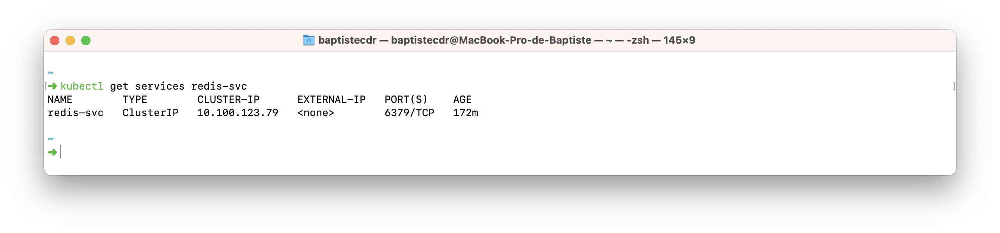
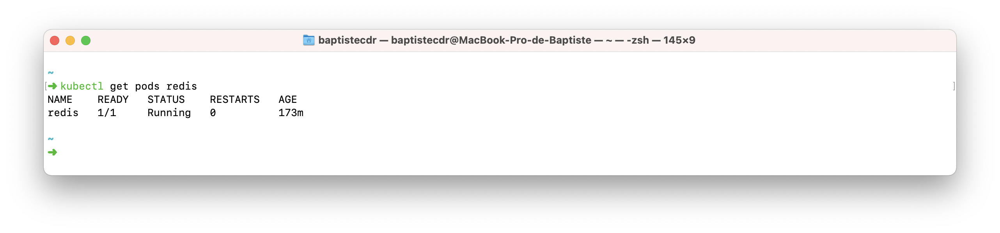
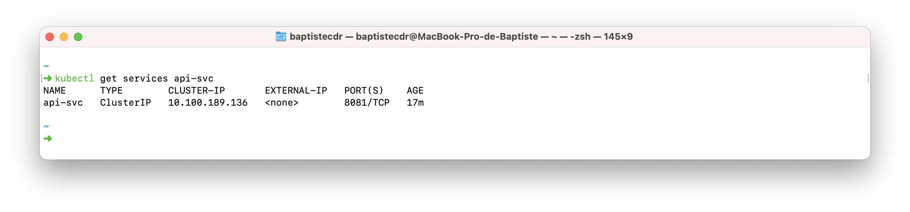
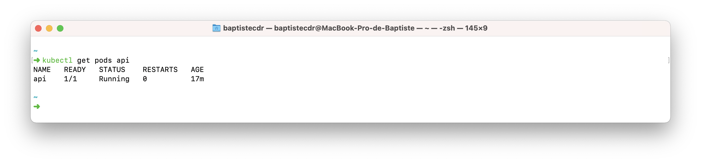
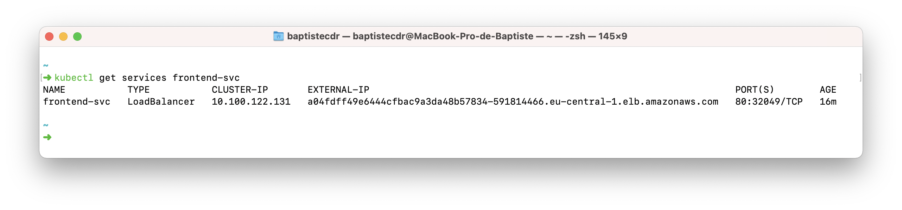
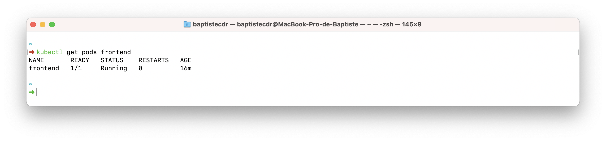
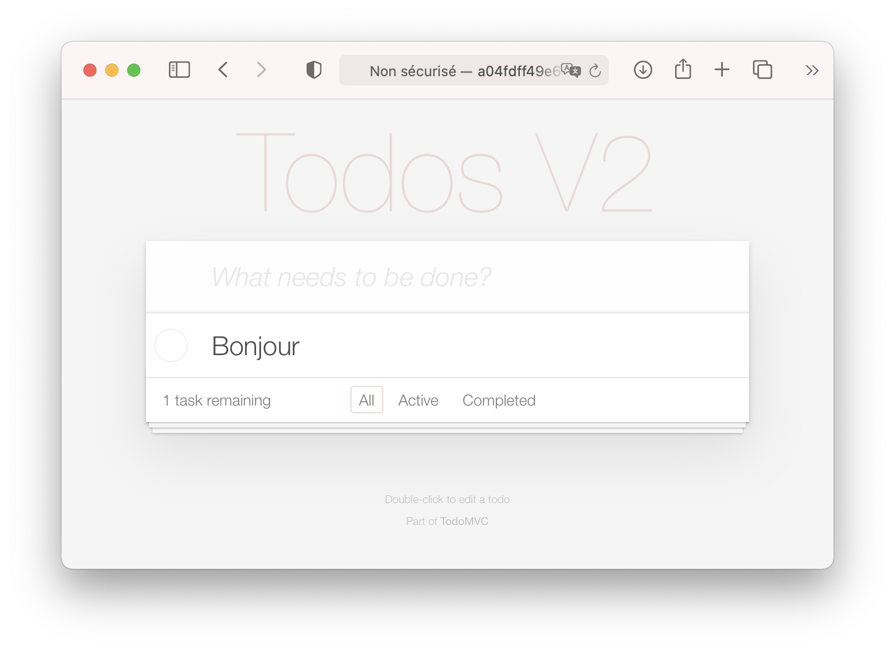
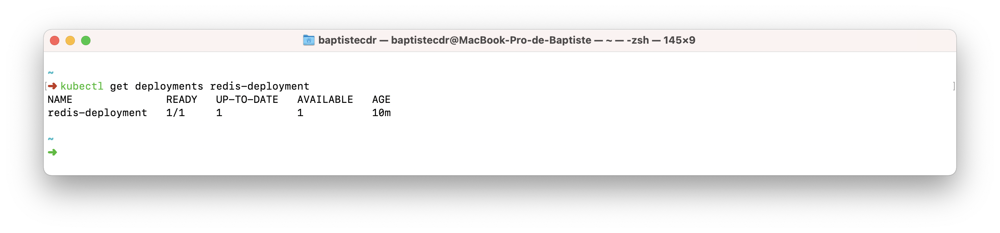
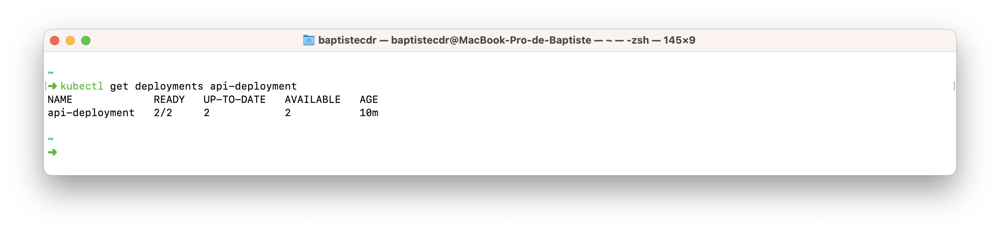
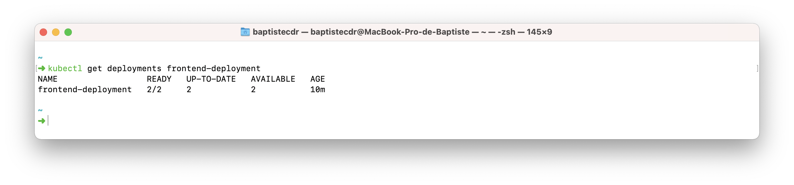

# TP - Introduction à Kubernetes
## Auteurs

- Baptiste Coudray
- Quentin Berthet

## Déploiement du service/pod Redis

Le fichier service et pod pour Redis étaient déjà créé, nous avons déployé via les commandes :
- `kubectl create -f redis-svc.yaml`
- `kubectl create -f redis-pod.yaml`

## Déploiement du service/pod API

Après la création du fichier service pour l'API, nous avons déployé via les commandes :
- `kubectl create -f api-svc.yaml`
- `kubectl create -f api-pod.yaml`

## Déploiement du service/pod Frontend

Après la création du fichier service et pod pour le _frontend_, nous avons déployé via les commandes :
- `kubectl create -f frontend-svc.yaml`
- `kubectl create -f frontend-pod.yaml`

Nous avons récupéré l'adresse IP publique via la commande `kubectl get services frontend-svc`

## Déploiement du deployment Redis

Après la création du fichier _deployment_ de Redis, nous avons déployé via la commande :
- `kubectl create -f redis-deploy.yaml`

On utilise une seule instance car il n'y a pas la gestion de synchronisation entre deux bases de données.

## Déploiement du deployment API

Après la création du fichier _deployment_ de l'API, nous avons déployé via la commande :
- `kubectl create -f api-deploy.yaml`

## Déploiement du deployment Frontend

Après la création du fichier _deployment_ du _frontend_, nous avons déployé via la commande :
- `kubectl create -f frontend-deploy.yaml`

## Questions
- What happens if you delete a Frontend or API Pod? How long does it take for the system to react?
    - A la supression d'un pod, Kubernetes en recrée un. Il faut ~40sec au système pour gérer la suppression/création d'un pod.
- What happens when you delete the Redis Pod?
    - Il recrée un container Redis
- How can you change the number of instances temporarily to 3? Hint: look for scaling in the deployment documentation
    - On peut _scale_ un _deployment_ via la commande `kubectl scale --current-replicas=2 --replicas=3 deployment/api-deployment`
- What autoscaling features are available? Which metrics are used?
    - On peut _autoscale_ les composants suivant : Deployment, ReplicaSet, StatefulSet, or ReplicationController
    - Il y a différents type d'_autoscaling_ :
        - Horizontal Pod Autoscaler : ajuste le nombre de replicas d'une application
        - Vertical Pod Autoscaler : ajuste les limites d'un container
        - Cluster : ajuste le nombre de nœud d'un cluster
    - Plusieurs _metrics_ : pourcentage du CPU utilisé, nombre de requêtes
- How can you update a component? (see update in the deployment documentation)
    - On peut mettre à jour un composant via la commande `kubectl edit deployments api-deployment`
